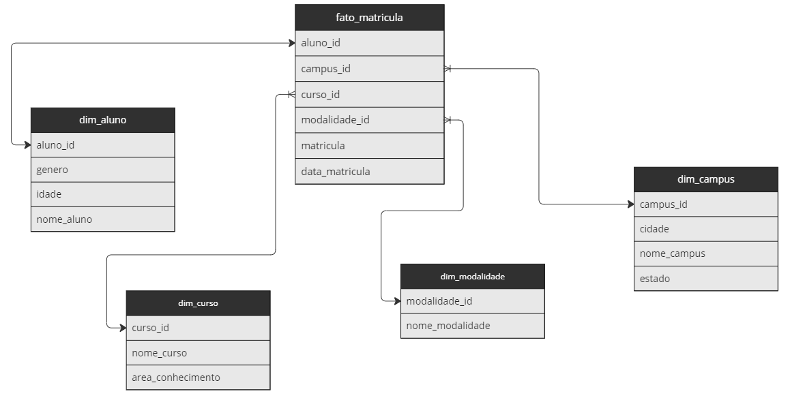
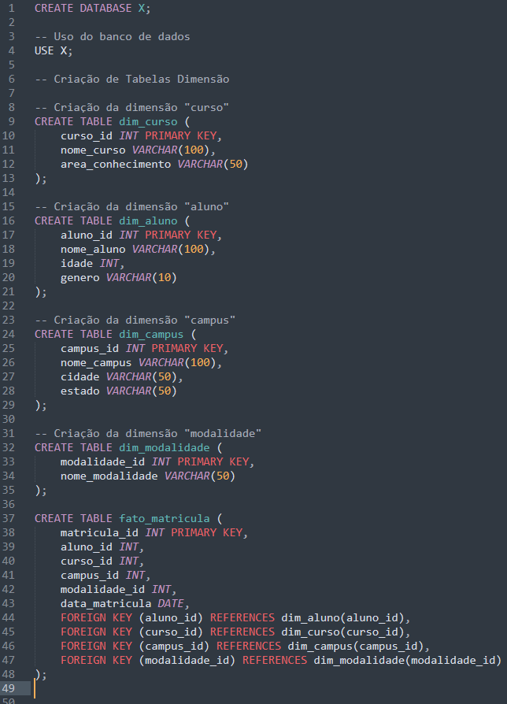
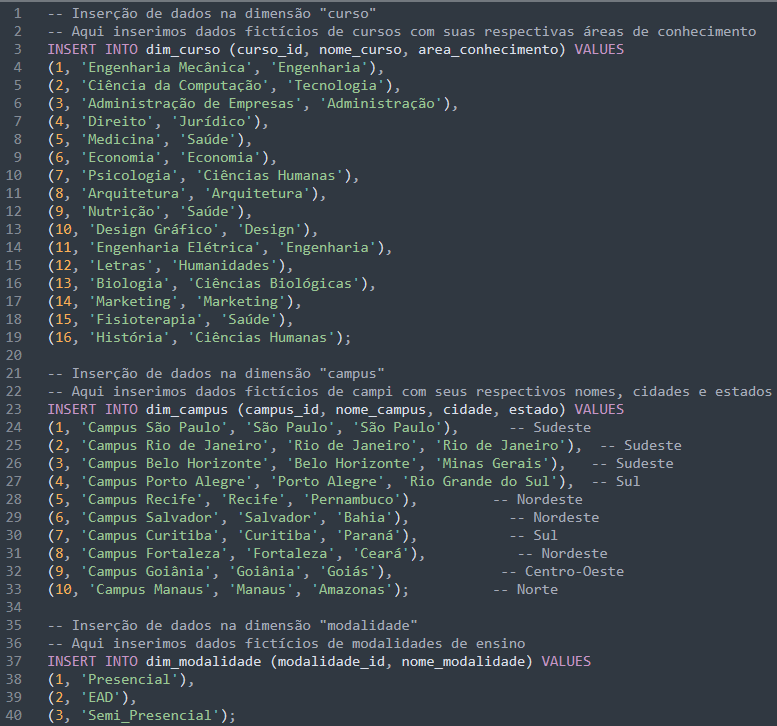
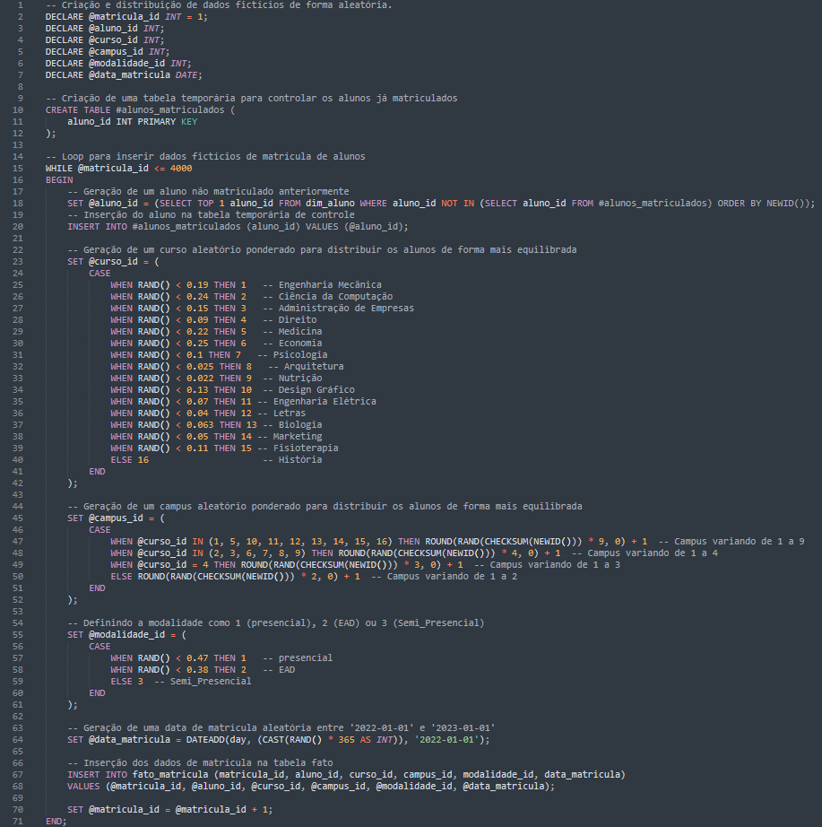
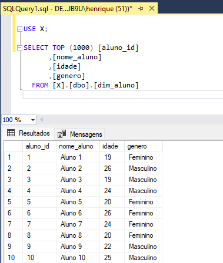
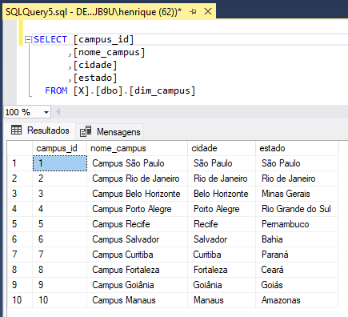
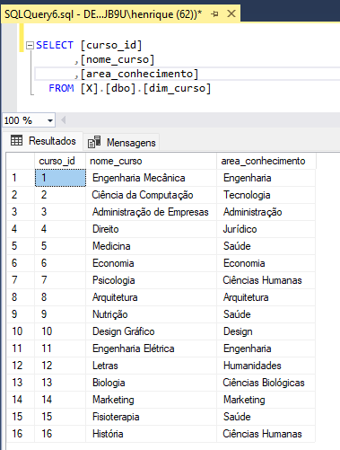
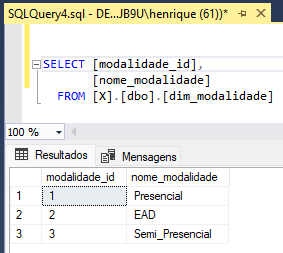
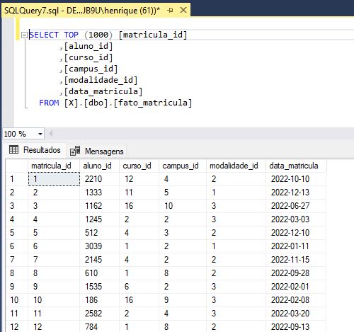
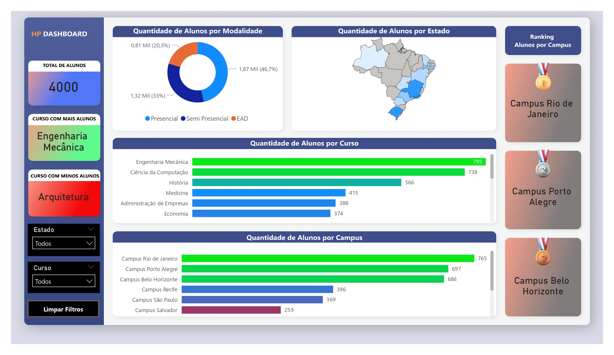

<h1> Projeto - Da geração de dados Fictícios ao Dashboard </h1>

<h2> A ideia deste projeto é criar uma data-base, gerar dados fictícios usando apenas linguagem T-SQL e desenvolver um dashboard no Power Bi com esses dados. </h2>

**Ferramentas utilizadas:**  
SQL SERVER   
POWER BI  
FIGMA  
MIRO APP

**Primeira Etapa**

Entender a regra de negócio e definir a modelagem, aqui utilizei o app Miro. 

Precisamos de um banco de dados para armazenar informações referentes aos alunos, campus e cursos.  

Cada aluno só pode estar matriculado em um único curso.  

Baseado nisso decidi usar o Star squema e criar as seguintes tabelas:  

Tabela dimensão para armazenar informações dos alunos: nome, idade e gênero, id_aluno.  

Tabela dimensão para armazenar informações dos campus: nome, cidade e estado, id_campus.  

Tabela dimensão para armazenar informações dos cursos: nome, área de conhecimento, id_curso. 

Tabela dimensão para armazenar informações das modalidades: nome, modalidade_id.  

Tabela fato contendo a data de matrícula do aluno, id de matricula, e as respectivas chaves para se conectar as tabelas dimensão.  

Segue a imagem da modelagem feita, no app miro:  

           
          

**Segunda Etapa**  

Criar a data-base, tabelas dimensão e tabela fato.  

Nessa etapa vamos utilizar o SQL SERVER para criar a data-base contendo as tabelas definidas na modelagem.  

Segue a imagem do script .sql:  

           

**Terceira Etapa**

Inserir dados manualmente nas tabelas dimensão campus, curso e modalidade.

Nessa etapa vamos inserir os dados de forma manual usando apenas o comando INSERT INTO VALUES.

Segue a imagem do script .sql:

           

**Quarta Etapa**

Desenvolver um código em T-SQL para gerar dados fictícios e inserir esses dados na tabela dim_aluno.
 
Aqui usei um loop WHILE para gerar dados fictícios de 4 mil alunos em  T-SQL. Cada registro tem um aluno_id único, nome_aluno gerado automaticamente, idade entre 18 e 28 anos e gênero aleatório (Masculino ou Feminino). O loop incrementa o contador a cada iteração até atingir 4000 registros. Em seguida inseri os dados na tabela dim_aluno usando o comando INSERT INTO.

Segue a imagem do script .sql:

           

**Quinta Etapa**

Desenvolver um código em SQL para gerar dados fictícios e inserir esses dados na tabela fato_matricula.

Dessa vez utilizei o loop WHILE para gerar 4000 registros fictícios de matrículas, cada um com um aluno, curso, campus, modalidade e data de matrícula aleatórios.

Em seguida usei o comando INSERT para inseri-los na tabela fato_matricula.

Segue a imagem do script .sql:

           

**Antes de desenvolver o dashboard, vamos ver como ficou nosso banco de dados ?**

**Segue as imagens das tabelas:**

**Tabela dim_aluno:**  
 

**Tabela dim_campus:**  

**Tabela dim_curso:**  

**Tabela dim_modalidade:**  

**Tabela fato_matricula:**  

**Sexta Etapa**

**Definir quais os KPI'S importantes e então elaborar Storytelling, conectar o Power bi na base de dados e desenvolver o dashboard , aqui utilizei o Figma para fazer o background.**

**KPI'S:**

Quantidade de alunos em cada curso, campus e região

Distribuição de alunos por modalidade

Cursos mais populares e menos populares

Segue a imagem do dashboard:

           

